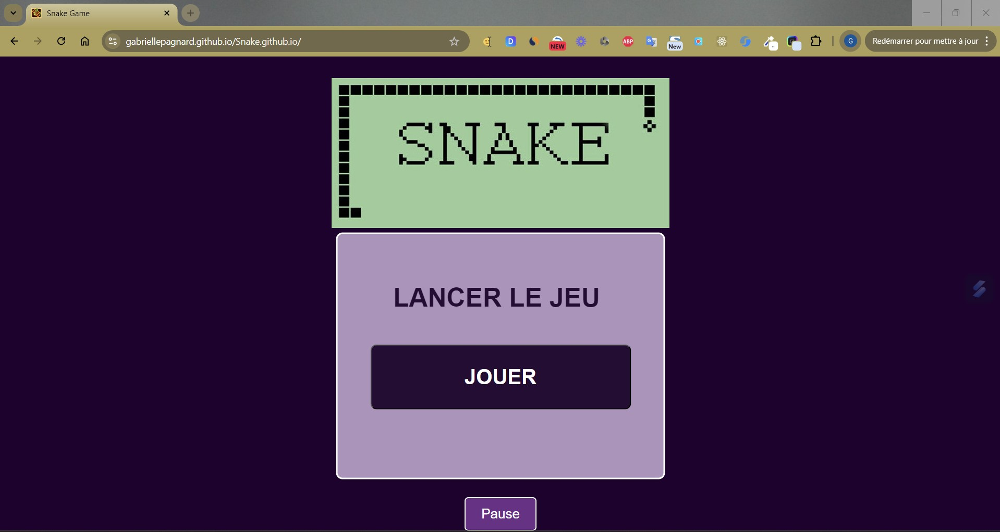
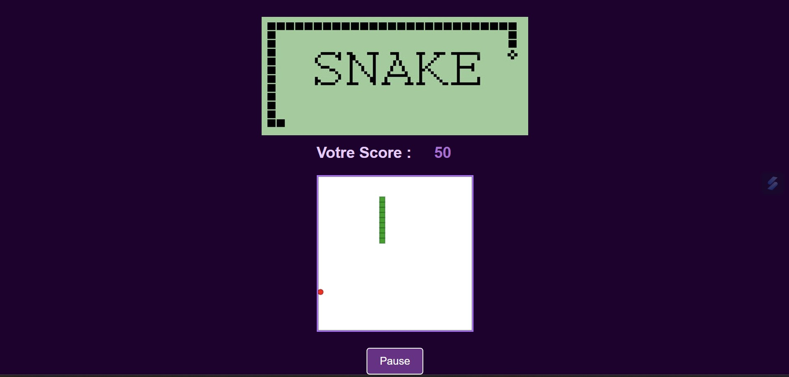
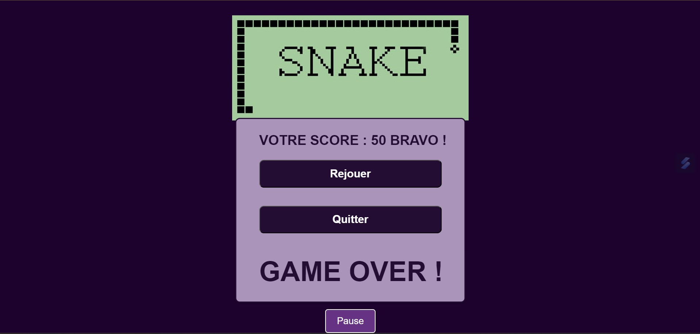

# 🐍🎮 Jeu du Snake 🎮🐍

 

## 📜 Présentation

Bienvenue dans le projet Snake Game ! Ce classique intemporel revient dans une version modernisée et optimisée pour le web, offrant une expérience fluide et addictive. Avec une interface élégante et des fonctionnalités captivantes, ce jeu saura vous faire replonger dans l'univers des jeux rétro tout en profitant des avantages des technologies modernes.     

 
 

## ✨ Fonctionnalités Principales

🎮 Gameplay classique : Replongez dans l'expérience du jeu Snake, avec des graphismes modernisés et une jouabilité fluide   
🏆 Système de score dynamique : Accumulez des points en mangeant des pommes et voyez votre score augmenter en temps réel   
⏩ Augmentation de la vitesse : Le jeu devient de plus en plus rapide à chaque pomme mangée, rendant le défi encore plus excitant   
⏸️ Mode Pause : Mettez le jeu en pause à tout moment pour reprendre plus tard, sans perdre votre progression   
💻 Interface responsive : Le jeu s'adapte à toutes les tailles d'écran, vous permettant de jouer aussi bien sur mobile que sur ordinateur   
🎨 Design personnalisé : Profitez d'une interface visuelle agréable avec un arrière-plan stylisé et des fenêtres pop-up élégantes.   

 
 

## 📸 Aperçu

Voici à quoi ressemble l'application :   

   

   

   

[Démo vidéo du projet 🎥](https://www.youtube.com/watch?v=dOzv-hM1oEQ)

 
 

## 🌐 Lien direct

Pour jouer : [SNAKE 🐍](https://gabriellepagnard.github.io/Snake/)   

 
 

## 🔧 Technologies Utilisées

- HTML 🏗️    
- CSS 🎨   
- JavaScript ⚙️   

 
 

## 📂 Fichiers du Projet

- index.html : Structure du jeu   
- style.css : Feuille de style personnalisée   
- app.js : Script pour la logique du jeu    
- images/ : Contient les images utilisées dans le projet   

 
 

## 🛠️ Installation et Utilisation

Pour démarrer avec Snake, suivez ces étapes simples :   

➡️ Clonez le Répertoire :   

`git clone https://github.com/votre-utilisateur/Snake.github.io.git`   

➡️ Accédez au Répertoire :   

`cd snake`   

➡️ Ouvrez le Fichier "index.html" dans votre navigateur pour voir l'application en action   

➡️ Personnalisez le Code selon vos besoins ou apportez des contributions !   

 
 

## 🏗️ Comment Contribuer

Vous souhaitez contribuer ? 🎉 Voici comment faire :   

### Créer une Branche 🌿

➡️ Pour chaque nouvelle fonctionnalité ou correction, créez une nouvelle branche :   

`git checkout -b nom-de-la-branche`   

### Faire vos Changements ✏️   

Apportez les modifications nécessaires et committez-les :   

`git add .`   
`git commit -m "Description des changements"`   

### Pousser les Changements ⬆️   

Envoyez vos modifications à GitHub 📨 :

`git push origin nom-de-la-branche`   

### Créer une Pull Request 🔄   

Allez sur GitHub, ouvrez une Pull Request et expliquez vos modifications   

 
 

## 🤝 Contributeurs/trices

Gabrielle Pagnard 🧑‍💻 - Créatrice du projet

 
 

## 📬 Contact

Pour toute question ou suggestion, n'hésitez pas à me contacter :   

Email : gpagnard@gmail.com   
GitHub : [GabriellePagnard](https://github.com/GabriellePagnard)     

 
 
 

Merci d'avoir visité le projet Snake ! 🚀   

Nous espérons que vous vous amuserez autant en jouant au Jeu du Snake que nous avons eu à le développer ! 🎉 
N'hésitez pas à laisser un ⭐ si vous aimez ce projet !  
